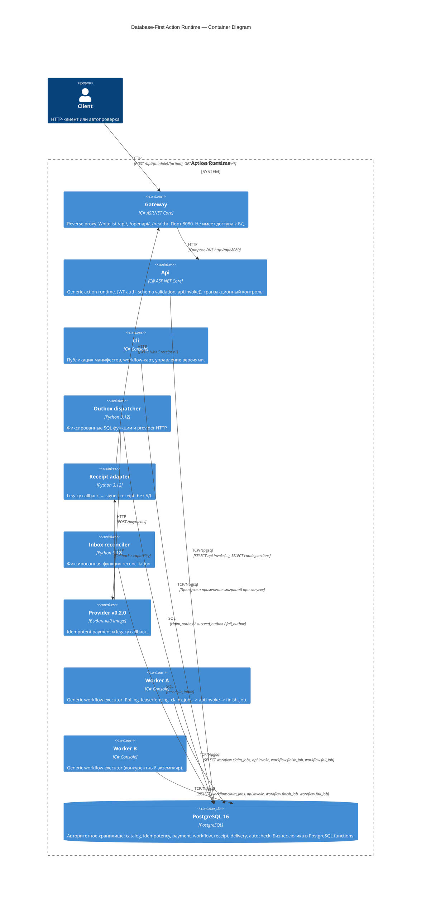

# C4 Container Diagram

## Контекст

Database-First Action Runtime — финтех-платформа для выполнения бизнес-операций через зарегистрированные PostgreSQL-функции.

## Диаграмма контейнеров

## Потоки данных

1. **Action call**: Client → Gateway (`:8080`) → Api (internal) → PostgreSQL (`api.invoke`)
2. **Workflow Worker**: Worker (A/B) → PostgreSQL (отдельная короткая транзакция `claim_jobs`, затем общая транзакция `api.invoke` + validation + `finish_job`; при rollback — отдельный `fail_job`)
3. **Publication & CLI**: Cli → PostgreSQL (`catalog.actions`, `workflow.flow_versions`, `workflow.start_process`)
4. **Migration**: Cli → PostgreSQL (миграции)
5. **Health**: Client → Gateway `/health/ready` → Api `/health/ready` → PostgreSQL (проверка готовности каталога и функций `catalog.actions` / `api.invoke`)
6. **OpenAPI**: Client → Gateway `/openapi/*` → Api → PostgreSQL `catalog.actions`

## Сетевая изоляция

- Gateway — единственный контейнер с опубликованным host-портом (`8080`), подключен к `gateway-net`.
- Api подключен к `gateway-net` (для приема трафика от Gateway) и `course-net` (для взаимодействия с PostgreSQL).
- Cli, PostgreSQL, Worker-A/B, Outbox-dispatcher и Inbox-reconciler доступны только внутри Docker network `course-net`.
- Receipt-adapter изолирован в `gateway-net` и не имеет прямого доступа к PostgreSQL.
- Provider подключён к обеим сетям: принимает запросы dispatcher и отправляет callback adapter. Host-портов у него нет.
- Gateway не имеет credentials к PostgreSQL и не выполняет SQL.
