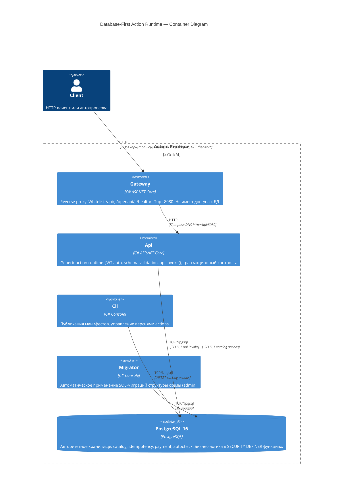

# C4 Container Diagram

## Контекст

Database-First Action Runtime — финтех-платформа для выполнения бизнес-операций через зарегистрированные PostgreSQL-функции.

## Диаграмма контейнеров

## Потоки данных

1. **Action call**: Client → Gateway (`:8080`) → Api (internal) → PostgreSQL (`api.invoke`)
2. **Publication**: Cli → PostgreSQL (`catalog.actions`)
3. **Migration**: Migrator → PostgreSQL (миграции)
4. **Health**: Client → Gateway `/health/ready` → Api `/health/ready` → PostgreSQL `SELECT 1`
5. **OpenAPI**: Client → Gateway `/openapi/*` → Api → PostgreSQL `catalog.actions`

## Сетевая изоляция

- Gateway — единственный контейнер с опубликованным host-портом (`8080`).
- Api, Cli, PostgreSQL доступны только внутри Docker network `course-net`.
- Gateway не имеет credentials к PostgreSQL и не выполняет SQL.
